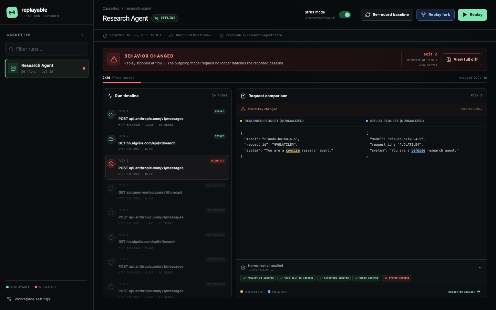

# Replayable

Replayable is a record/replay harness for HTTP-based workloads running in
Docker. It records a container's traffic through a host-side mitmproxy, stores
a redacted and versioned cassette, and later serves those responses back
without contacting the original servers.

The workload does not import Replayable and needs no SDK. It only has to run in
Docker, speak HTTP(S), trust the mounted CA, and honour the injected proxy
variables.

**What that buys you:** the checked-in research-agent cassette is 20 recorded
calls to Anthropic, Hacker News, and Open-Meteo. Recording it took 32.0s and
real API spend. Replaying it takes ~0.6s, costs $0.00, needs no API key, and
reproduces the agent's workspace and stdout **byte for byte**.

Those two hashes are asserted on every CI run. Strict image identity — replay
refusing to run unless the exact recorded image ID is present locally — is a
separate, stronger check: CI rebuilds the image, so its ID differs, and CI
therefore runs with `--allow-image-mismatch`. Set `REPLAYABLE_STRICT_IMAGE=1`
locally to assert identity as well.



## Contents

- [Install](#install) · [Quickstart](#quickstart) · [What it does](#what-it-does)
- [Commands](#commands) · [Dashboard](#dashboard) · [CI](#ci)
- [Full documentation index](docs/README.md)

## Install

You need Python 3.12+, [uv](https://docs.astral.sh/uv/), and Docker Engine
20.10+ or Docker Desktop.

```sh
uv sync --locked
```

Generate the mitmproxy CA once. Start mitmdump, wait for it to report that it
is listening, and stop it with Ctrl-C:

```sh
uv run mitmdump
```

That writes `~/.mitmproxy/mitmproxy-ca-cert.pem`. Replayable mounts it
read-only at `/etc/replayable/ca.pem` and sets `SSL_CERT_FILE`,
`REQUESTS_CA_BUNDLE`, `CURL_CA_BUNDLE`, and `NODE_EXTRA_CA_CERTS`. If it is
missing, Replayable exits 3 and tells you to run mitmdump once.

Then check the environment:

```sh
uv run replayable doctor
```

## Quickstart

Record the demo agent, then replay it offline. Create
`demo/research_agent/.env` from its example with your `ANTHROPIC_API_KEY`
first — only `record` needs it.

```sh
docker build -t replayable/agent-base:local images/agent-base
docker build -t replayable/research-agent:local demo/research_agent

uv run replayable record --image replayable/research-agent:local \
  --env-file demo/research_agent/.env --out cassettes/research-agent \
  -- python /app/agent.py "deterministic replay for LLM agents"

uv run replayable replay --cassette cassettes/research-agent --strict
```

Replay runs the exact recorded image digest, freezes the wall clock, and
injects `ANTHROPIC_API_KEY=[REDACTED:ANTHROPIC_API_KEY]`. It should print:

```text
DETERMINISTIC ✓ (workspace sha256 matches)
```

For the strongest demonstration, disconnect the host after recording.

**No API key?** Replay the cassette already checked in under
`tests/fixtures/cassettes/`. Copy it first — replay writes its report, logs,
and transcripts into the cassette directory, and that fixture is tracked:

```sh
cp -R tests/fixtures/cassettes/research-agent /tmp/demo-cassette
chmod -R u+w /tmp/demo-cassette
uv run replayable replay --cassette /tmp/demo-cassette --strict
```

That is the same run the acceptance suite gates on. There is also a keyless
curl workload in `images/agent-base` (see `tests/e2e/test_m1_curl.py`).

## Mental model

```text
record
  ├── starts mitmdump with the recording addon
  ├── starts your container with proxy + CA settings injected
  ├── records each completed HTTP flow into flows.jsonl
  ├── captures stdout/stderr and a structured run log
  └── snapshots /workspace and finalizes manifest.json

replay
  ├── loads and normalizes the recorded requests
  ├── starts mitmdump with the replay addon
  ├── starts the exact recorded image digest with its clock pinned
  ├── matches live requests against per-key FIFO queues
  ├── synthesizes responses before mitmproxy can dial upstream
  └── compares workspace and transcript hashes
```

## What it does

| | |
|---|---|
| **Transparent recording** | Routes an unmodified container's HTTP/HTTPS through mitmproxy via injected proxy and CA variables. |
| **Structurally offline replay** | Responses are attached in mitmproxy's `request` hook, so a replay has no upstream connection path at all — matched or not. |
| **Versioned cassettes** | Inspectable JSONL flows, a manifest, content-addressed blobs, workspace archive, and transcripts. |
| **Secret redaction** | Auth headers and secret-classified env values are stripped at write time, from bodies and captured stdout/stderr. |
| **Normalized matching** | Volatile JSON fields (ids, timestamps, nonces) are canonicalized before hashing, with per-project overrides and an `--explain-match` view. |
| **Determinism pinning** | Frozen clock, stable Python hash seed, and replay by immutable image digest. |
| **Verification** | Workspace hash, file-level diff, and byte-level stdout comparison against the recording. |
| **Mismatch diagnostics** | Structured report naming the first diverging request, its nearest recorded candidates, and a unified body diff. |
| **SSE support** | Streaming chunk boundaries are recorded and replayed, not just the concatenated body. |
| **Fork / hybrid replay** | Serve the first N flows frozen, then let the rest run live, and compare downstream behaviour against the baseline. |
| **Dashboard** | Local run explorer packaged inside the Python wheel — no Node needed to use it. |
| **Baseline management** | `accept` records a candidate, shows a bounded diff, and replaces the baseline atomically. |
| **CI gate** | A composite Action that replays on every PR, comments a verdict, and emits JUnit. |

Each of these is documented with what unlocks it and how to demonstrate it in
the [capability guide](docs/capabilities.md).

## Commands

| Command | Purpose |
|---|---|
| `replayable record --image IMG -- CMD` | Record a container run into a cassette. |
| `replayable replay --cassette DIR` | Replay offline. `--strict` fails on unconsumed flows; `--fork-at N` resumes live after N flows. |
| `replayable accept --cassette DIR` | Record, review, and atomically replace a baseline. |
| `replayable inspect --cassette DIR` | Print the manifest and flow table; `--explain-match` shows normalization. |
| `replayable ui --cassette-root DIR` | Serve the dashboard on `127.0.0.1`. |
| `replayable doctor` | Preflight the CA, Docker, host gateway, clock, and proxy port. |

Exit codes: `0` success, `1` the workload failed, `2` replay diverged, `3`
harness error. Full flags and behaviour are in the
[command reference](docs/cli.md).

## Dashboard

```sh
uv run replayable ui --cassette-root ./cassettes
```

Browse cassettes, step through the run timeline, and see the first diverging
request with normalization rules applied so volatile fields do not read as
regressions. Add `--allow-write` to run replays, forks, and baseline
recordings from the UI. It binds to loopback only.

The React source is in `ui/`, but the built assets ship inside the Python
package — end users never install Node. See the
[dashboard guide](docs/dashboard/README.md).

## CI

`actions/github` is a composite action that replays a cassette, posts a
pull-request verdict with the first divergence and the API cost avoided, and
uploads JUnit plus replay artifacts.

```yaml
- uses: ./actions/github
  with:
    cassette: path/to/cassette
    strict: "true"
```

See the [Action guide](actions/github/README.md) and the
[CI runbook](docs/ci.md).

## Documentation

| Guide | What's in it |
|---|---|
| [Capability guide](docs/capabilities.md) | Every feature, what unlocks it, how to demo it |
| [Command reference](docs/cli.md) | Full CLI flags and semantics |
| [Dashboard](docs/dashboard/README.md) | Read-only, write-enabled, fork, and UI development |
| [GitHub Action](actions/github/README.md) | Adding the gate to a pull-request workflow |
| [CI runbook](docs/ci.md) | The three repository workflows |
| [Architecture decisions](docs/architecture/README.md) | Event log, policy resolution, fork replay, packaged UI |
| [Codebase guide](docs/codebase.md) | Module layout and call graph |
| [Development](docs/development.md) | Tests, coverage gates, evaluation scripts |
| [Troubleshooting](docs/troubleshooting.md) | CA, TLS, proxy, and mismatch failures |
| [Security model](docs/security.md) | What is and is not protected; supported clients |
| [Limitations](docs/limitations.md) | Certificate pinning, static binaries, non-HTTP, concurrency |
| [Research-agent demo](demo/research_agent/README.md) | The complete recorded demonstration |

## Scope

Replayable is Docker- and HTTP-focused by design. It does not record non-HTTP
protocols, bypass certificate pinning, intercept RNG syscalls, pin time in
statically linked binaries, or tolerate concurrent identical requests. The
matcher is deliberately strict: a near candidate explains a failure but is
never served as a match.

Cassettes can contain proprietary response data after credentials are
redacted. Review one before sharing it.
